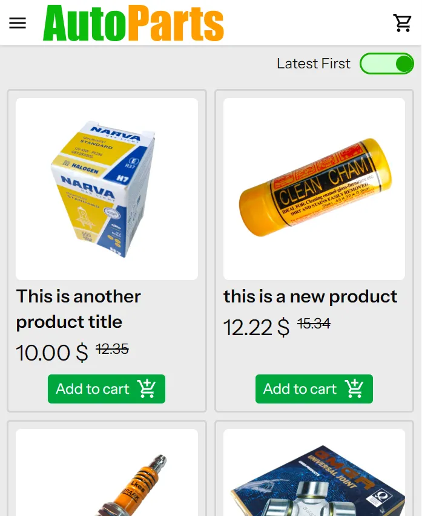
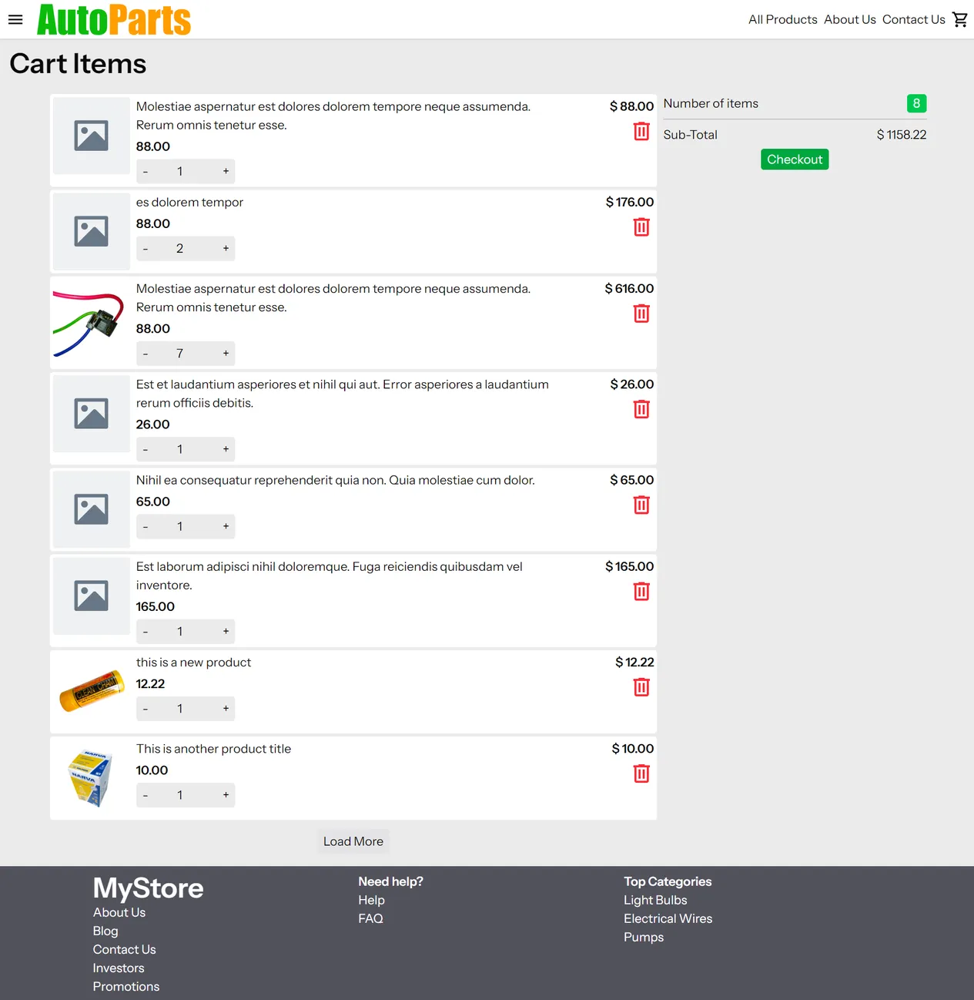
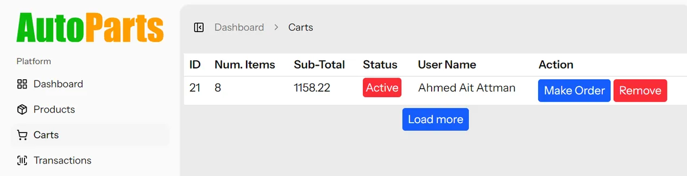
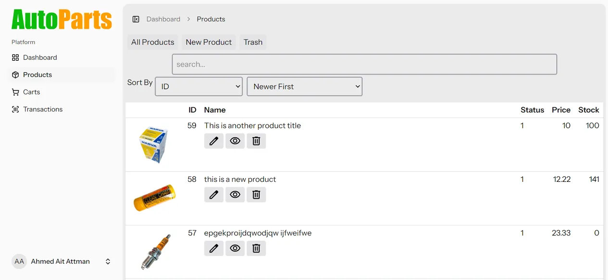

# Simple Laravel Shopping Cart Project
This is a simple shopping cart application example based on **Laravel** framework, **Inertia JS**, **React JS** and **Tailwind CSS**

### Workflow

1. The user/visitor can browse products in index page (/products), view each product in a single page (/products/{productSlug}).
2. A user must be logged in to be able to add items to the cart
3. After adding items to cart, the user can submit/finish the order (order status changes from "active" to "pending" )
4. An admin, in dashboard, can then convert user cart into "order", and update stock quantity (programmatically) and **send email** to the admin if a product is running low.
5. In every evening, a **sales report** is sent to the admin via email.

### Admin role code

admin role code is 10 (db column: "role" in users table)\
// check this enum for all roles:
> App\Data\UserRole

if user role is not admin, in dashboard, items like "products","carts", "transactions" won't be visible
### Admin email to receive sales reports
This email is defined in .env file with key: ADMIN_EMAIL

## Screenshots
### Products Index:

### Cart:

### List of carts in admin dashboard

### List of products in admin dashboard

